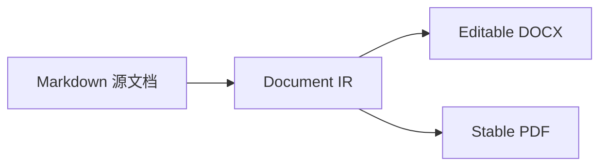

# P3 导出回归样本：中英混排、长表、代码、公式与资源

> 本文件是导出后端的**语义黄金输入**，不是页面截图基准。它覆盖的断言只证明 IR、OOXML 与 PDF 结构；Word、LibreOffice 和 PDF 阅读器的视觉结果仍须在发布验证中人工留档。

## 摘要 Summary

项目 **Markdown 阅读器** 预计在 2026-07-16 交付，预算为 CNY 80,000（完成率 80%）。
行内公式 $E=mc^2$、`npm run build`、[设计说明](./design.md) 与 Emoji ✅ 都必须保留其文本语义。

- [x] 中文技术排版确认
- [ ] Export acceptance / 导出验收

## 资源与图表 Resources




## 公式与代码 Formula and code

$$
\sum_{i=1}^{n} i = \frac{n(n+1)}{2}
$$

```ts
const release = {
  name: 'Markdown 阅读器',
  budget: 80_000,
  verify: () => 'npm test && npm run build',
}
```

## 长表 Long table

| 编号 | Owner | 完成率 | 预算 | 日期 | 状态 | 文档 URL | 命令/备注 |
| :--- | :--- | ---: | ---: | :--- | :---: | :--- | :--- |
| PRJ-001 | 王小明 | 80% | CNY 80,000 | 2026-07-16 | done | https://example.com/docs/a-very-long-path/for-wrapping | `npm test`；中文、Emoji ✅ |
| PRJ-002 | Alice | 12.5% | $1,200.50 | 2026-08-01 | pending | https://example.com/spec | 空值与换行<br>由预检提示 |
| PRJ-003 | 李雷 | 0% | CNY 0 | 2026-08-02 | todo | https://example.com/guide/003 | 需要确认 |
| PRJ-004 | Bob | 25% | CNY 4,500 | 2026-08-03 | doing | https://example.com/guide/004 | unit: ms |
| PRJ-005 | 韩梅梅 | 30% | CNY 5,000 | 2026-08-04 | doing | https://example.com/guide/005 | table cell |
| PRJ-006 | Carol | 35% | CNY 5,500 | 2026-08-05 | doing | https://example.com/guide/006 | table cell |
| PRJ-007 | 张伟 | 40% | CNY 6,000 | 2026-08-06 | doing | https://example.com/guide/007 | table cell |
| PRJ-008 | David | 45% | CNY 6,500 | 2026-08-07 | doing | https://example.com/guide/008 | table cell |
| PRJ-009 | 王芳 | 50% | CNY 7,000 | 2026-08-08 | doing | https://example.com/guide/009 | table cell |
| PRJ-010 | Emma | 55% | CNY 7,500 | 2026-08-09 | doing | https://example.com/guide/010 | table cell |
| PRJ-011 | 刘洋 | 60% | CNY 8,000 | 2026-08-10 | done | https://example.com/guide/011 | table cell |
| PRJ-012 | Frank | 65% | CNY 8,500 | 2026-08-11 | done | https://example.com/guide/012 | table cell |
| PRJ-013 | 陈晨 | 70% | CNY 9,000 | 2026-08-12 | done | https://example.com/guide/013 | table cell |
| PRJ-014 | Grace | 75% | CNY 9,500 | 2026-08-13 | done | https://example.com/guide/014 | table cell |
| PRJ-015 | 杨帆 | 80% | CNY 10,000 | 2026-08-14 | done | https://example.com/guide/015 | table cell |
| PRJ-016 | Henry | 85% | CNY 10,500 | 2026-08-15 | done | https://example.com/guide/016 | table cell |
| PRJ-017 | 赵敏 | 90% | CNY 11,000 | 2026-08-16 | done | https://example.com/guide/017 | table cell |
| PRJ-018 | Iris | 95% | CNY 11,500 | 2026-08-17 | done | https://example.com/guide/018 | table cell |
| PRJ-019 | 孙磊 | 100% | CNY 12,000 | 2026-08-18 | done | https://example.com/guide/019 | table cell |
| PRJ-020 | Jack | 100% | CNY 12,500 | 2026-08-19 | done | https://example.com/guide/020 | table cell |
| PRJ-021 | 周宁 | 10% | CNY 13,000 | 2026-08-20 | todo | https://example.com/guide/021 | table cell |
| PRJ-022 | Kate | 15% | CNY 13,500 | todo | pending | https://example.com/guide/022 | table cell |
| PRJ-023 | 吴迪 | 20% | CNY 14,000 | 2026-08-22 | todo | https://example.com/guide/023 | table cell |
| PRJ-024 | Leo | 25% | CNY 14,500 | 2026-08-23 | doing | https://example.com/guide/024 | table cell |
| PRJ-025 | 郑爽 | 30% | CNY 15,000 | 2026-08-24 | doing | https://example.com/guide/025 | table cell |
| PRJ-026 | Mia | 35% | CNY 15,500 | 2026-08-25 | doing | https://example.com/guide/026 | table cell |
| PRJ-027 | 冯雪 | 40% | CNY 16,000 | 2026-08-26 | doing | https://example.com/guide/027 | table cell |
| PRJ-028 | Noah | 45% | CNY 16,500 | 2026-08-27 | doing | https://example.com/guide/028 | table cell |
| PRJ-029 | 何静 | 50% | CNY 17,000 | 2026-08-28 | doing | https://example.com/guide/029 | table cell |
| PRJ-030 | Olivia | 55% | CNY 17,500 | 2026-08-29 | doing | https://example.com/guide/030 | table cell |
| PRJ-031 | 高峰 | 60% | CNY 18,000 | 2026-08-30 | done | https://example.com/guide/031 | table cell |
| PRJ-032 | Peter | 65% | CNY 18,500 | 2026-08-31 | done | https://example.com/guide/032 | table cell |
| PRJ-033 | 丁一 | 70% | CNY 19,000 | 2026-09-01 | done | https://example.com/guide/033 | table cell |
| PRJ-034 | Quinn | 75% | CNY 19,500 | 2026-09-02 | done | https://example.com/guide/034 | table cell |
| PRJ-035 | 罗兰 | 80% | CNY 20,000 | 2026-09-03 | done | https://example.com/guide/035 | table cell |
| PRJ-036 | Ryan | 85% | CNY 20,500 | 2026-09-04 | done | https://example.com/guide/036 | table cell |
| PRJ-037 | 马可 | 90% | CNY 21,000 | 2026-09-05 | done | https://example.com/guide/037 | table cell |
| PRJ-038 | Sofia | 95% | CNY 21,500 | 2026-09-06 | done | https://example.com/guide/038 | table cell |
| PRJ-039 | 蒋欣 | 100% | CNY 22,000 | 2026-09-07 | done | https://example.com/guide/039 | table cell |
| PRJ-040 | Tom | 100% | CNY 22,500 | 2026-09-08 | done | https://example.com/guide/040 | table cell |
| PRJ-041 | 许诺 | 10% | CNY 23,000 | 2026-09-09 | todo | https://example.com/guide/041 | table cell |
| PRJ-042 | Uma | 15% | CNY 23,500 | 2026-09-10 | todo | https://example.com/guide/042 | table cell |
| PRJ-043 | 谢安 | 20% | CNY 24,000 | 2026-09-11 | todo | https://example.com/guide/043 | table cell |
| PRJ-044 | Vera | 25% | CNY 24,500 | 2026-09-12 | doing | https://example.com/guide/044 | table cell |
| PRJ-045 | 曹操 | 30% | CNY 25,000 | 2026-09-13 | doing | https://example.com/guide/045 | table cell |
| PRJ-046 | Will | 35% | CNY 25,500 | 2026-09-14 | doing | https://example.com/guide/046 | table cell |
| PRJ-047 | 魏无羡 | 40% | CNY 26,000 | 2026-09-15 | doing | https://example.com/guide/047 | table cell |
| PRJ-048 | Xenia | 45% | CNY 26,500 | 2026-09-16 | doing | https://example.com/guide/048 | table cell |
| PRJ-049 | 岳飞 | 50% | CNY 27,000 | 2026-09-17 | doing | https://example.com/guide/049 | table cell |
| PRJ-050 | Yuki | 55% | CNY 27,500 | 2026-09-18 | doing | https://example.com/guide/050 | table cell |

## 结尾

导出前必须提示远程资源、宽表与当前 PDF 后端的非 Latin-1 字符替代风险；不得把这些风险静默吞掉。
